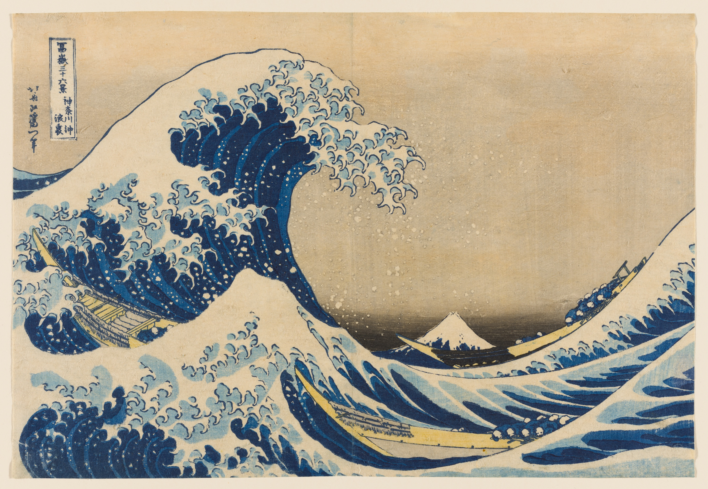
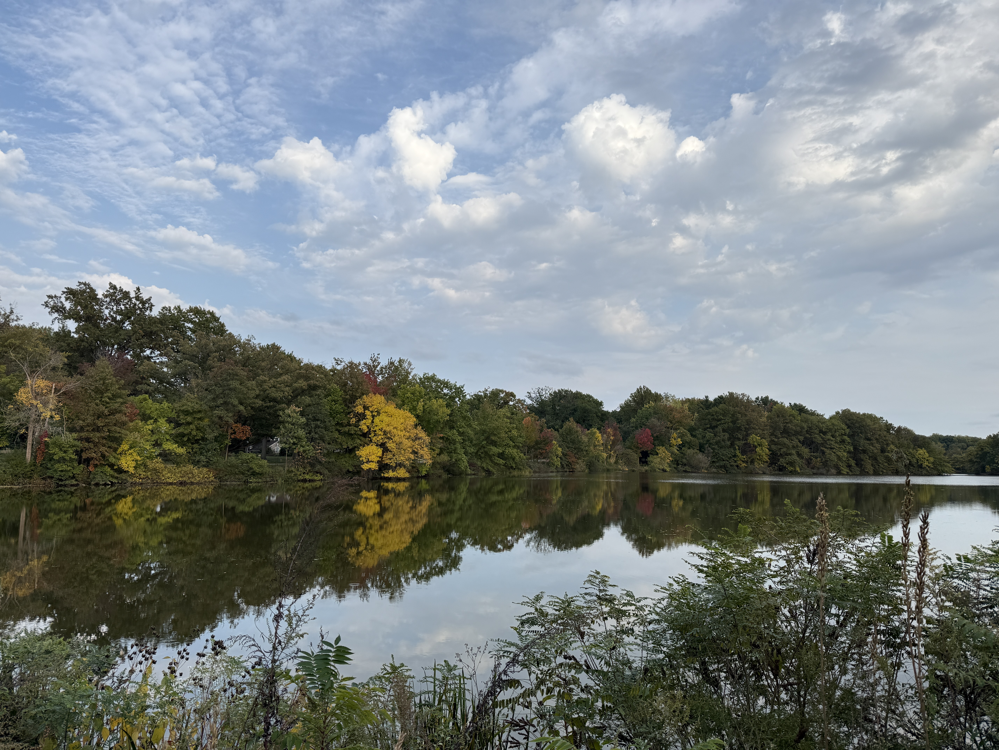

# Excel Pixel Art Generator

Convert an image into an Excel workbook where each cell is colored like a pixel.

Each generated workbook includes:

- `Reference` - the finished colored pixel-art image.
- `Template` - a paper-style paint-by-number canvas with light gray color index numbers.
- `Color Index` - one row per indexed color, with number, hex color code, swatch, and cell count.

The template uses Excel screen gridlines for editing, not real cell borders, so filled artwork can print without black border lines.

## Use Online

Open the hosted Streamlit app:

https://willgaolab-dvy5xga3u2xexllw7lei82.streamlit.app/

Use it to upload an image, choose paper size, set exact Excel-cell resolution, choose indexed color count, and download the generated workbook.

## Demo Workbooks

Two sample images are included so you can compare how resolution and color count affect the generated paint-by-number workbook.



| Detail | Resolution | Colors | Demo workbook |
| --- | ---: | ---: | --- |
| Starter | 80 x 56 | 16 | [wave_a4_080x056_016colors.xlsx](demos/wave_a4_080x056_016colors.xlsx) |
| Low | 120 x 85 | 32 | [wave_a4_120x085_032colors.xlsx](demos/wave_a4_120x085_032colors.xlsx) |
| Medium | 160 x 113 | 64 | [wave_a4_160x113_064colors.xlsx](demos/wave_a4_160x113_064colors.xlsx) |
| High | 200 x 141 | 128 | [wave_a4_200x141_128colors.xlsx](demos/wave_a4_200x141_128colors.xlsx) |
| Maximum | 240 x 170 | 256 | [wave_a4_240x170_256colors.xlsx](demos/wave_a4_240x170_256colors.xlsx) |



| Detail | Resolution | Colors | Demo workbook |
| --- | ---: | ---: | --- |
| Starter | 80 x 56 | 16 | [landscape_a4_080x056_016colors.xlsx](demos/landscape_a4_080x056_016colors.xlsx) |
| Low | 120 x 85 | 32 | [landscape_a4_120x085_032colors.xlsx](demos/landscape_a4_120x085_032colors.xlsx) |
| Medium | 160 x 113 | 64 | [landscape_a4_160x113_064colors.xlsx](demos/landscape_a4_160x113_064colors.xlsx) |
| High | 200 x 141 | 128 | [landscape_a4_200x141_128colors.xlsx](demos/landscape_a4_200x141_128colors.xlsx) |
| Maximum | 240 x 170 | 256 | [landscape_a4_240x170_256colors.xlsx](demos/landscape_a4_240x170_256colors.xlsx) |

All demo workbooks use A4 landscape paper setup and include `Reference`, `Template`, and `Color Index` sheets.

## Image Credits and Rights

Sample artwork:

- `image/UnderTheWaveOffKanagawa.jpg` is Katsushika Hokusai's *Under the Wave off Kanagawa (Kanagawa oki nami ura), also known as The Great Wave*, from the series *Thirty-Six Views of Mount Fuji (Fugaku sanjurokkei)*.
- Source: [The Art Institute of Chicago collection record](https://www.artic.edu/artworks/89503/under-the-wave-off-kanagawa-kanagawa-oki-nami-ura-also-known-as-the-great-wave-from-the-series-thirty-six-views-of-mount-fuji-fugaku-sanjurokkei).
- The Art Institute of Chicago identifies this artwork image as public domain / CC0 in its public collection records.

Sample photo:

- `image/IMG_0148.JPG` is a user-provided landscape photograph taken by William and included here with permission for demo generation.

Personal-use rights and liability:

- This project is provided for personal, educational, research, and non-commercial creative use only.
- Do not use this tool, the sample images, generated templates, generated workbooks, or derivative outputs for commercial sale, paid products, merchandise, advertising, client work, or other revenue-generating activity without independently securing all required rights and permissions.
- Users are solely responsible for ensuring they have the legal right to upload, transform, distribute, print, share, or otherwise use any image they process with this tool.
- The project maintainers do not claim ownership of user-uploaded images or generated workbooks, and do not grant any rights to third-party images.
- Generated outputs may still be subject to copyright, trademark, privacy, publicity, moral rights, museum/license terms, or other legal restrictions depending on the source image and jurisdiction.
- The hosted app and source code are provided as-is, without warranty. The project maintainers are not liable for misuse, infringement claims, losses, damages, takedown requests, printing costs, or other consequences arising from use of the tool or generated outputs.
- This README is not legal advice. For any commercial use, public distribution, uncertain image rights, or jurisdiction-specific questions, consult a qualified legal professional before using the image or output.

## Setup

```bash
python3 -m venv .venv
source .venv/bin/activate
python -m pip install -e .
```

## Usage

```bash
excel-pixel-art path/to/image.png
excel-pixel-art path/to/image.png -o output.xlsx --max-size 96
```

With the included sample image:

```bash
excel-pixel-art image/UnderTheWaveOffKanagawa.jpg -o wave.xlsx --max-size 128
excel-pixel-art image/IMG_0148.JPG -o landscape.xlsx --max-size 128
```

Use a paper canvas to auto-fit the image into a fixed Excel drawing area:

```bash
excel-pixel-art image/IMG_0148.JPG -o landscape_a4.xlsx --canvas-size a4 --orientation landscape --max-size 160
excel-pixel-art image/UnderTheWaveOffKanagawa.jpg -o wave_letter.xlsx --canvas-size letter --fit contain --max-size 160
```

Set an exact Excel cell resolution when you want full manual control:

```bash
excel-pixel-art image/IMG_0148.JPG -o custom_160x100.xlsx --resolution 160x100 --fit contain
excel-pixel-art image/UnderTheWaveOffKanagawa.jpg -o poster_240x160.xlsx --canvas-size a3 --resolution 240x160 --orientation landscape
```

`--resolution WIDTHxHEIGHT` means Excel columns x rows. When it is provided, it overrides `--max-size` and uses the exact grid size you request. You can still combine it with `--canvas-size` to set Excel print paper setup.

Control how many unique indexed colors are used:

```bash
excel-pixel-art image/IMG_0148.JPG -o photo_32_colors.xlsx --resolution 160x100 --colors 32
```

`--colors` keeps the color index practical for photos by merging near-duplicate colors into a smaller palette. Default: `48`.

High-detail A4 example:

```bash
excel-pixel-art image/IMG_0148.JPG -o output/landscape_a4_high_detail_240x170_256colors.xlsx --canvas-size a4 --orientation landscape --resolution 240x170 --colors 256
```

This keeps the workbook print setup as A4 landscape while using a `240 x 170` Excel-cell template and a 256-color index.

Common canvas presets:

- `a0` - 841 x 1189 mm
- `a1` - 594 x 841 mm
- `a2` - 420 x 594 mm
- `a3` - 297 x 420 mm
- `a4` - 210 x 297 mm
- `a5` - 148 x 210 mm
- `a6` - 105 x 148 mm
- `b0` - 1000 x 1414 mm
- `b1` - 707 x 1000 mm
- `b2` - 500 x 707 mm
- `b3` - 353 x 500 mm
- `b4` - 250 x 353 mm
- `b5` - 176 x 250 mm
- `b6` - 125 x 176 mm
- `letter` - 215.9 x 279.4 mm
- `legal` - 215.9 x 355.6 mm
- `executive` - 190.5 x 254.0 mm
- `folio` - 210.0 x 330.0 mm
- `ledger` - 432.0 x 279.0 mm
- `tabloid` - 279.0 x 432.0 mm
- `square` - 210 x 210 mm

ISO and common format dimensions are based on Engineering ToolBox's paper drafting size tables.

Canvas options:

- `--resolution WIDTHxHEIGHT`
- `--colors 48`
- `--orientation auto|portrait|landscape`
- `--fit contain|cover`
- `--background-color FFFFFF`

You can also run the compatibility wrapper:

```bash
python img_to_excel.py path/to/image.png
```

## Web Upload

The hosted Streamlit app is the easiest way to use the tool:

```text
https://willgaolab-dvy5xga3u2xexllw7lei82.streamlit.app/
```

There are two local web interfaces. Use the Streamlit app for normal use; keep the lightweight HTTP app as a minimal fallback.

### Streamlit Interface

Recommended for interactive upload/download.

Install and start:

```bash
python3 -m venv .venv
source .venv/bin/activate
python -m pip install -e .
excel-pixel-art-streamlit
```

Then open:

```text
http://127.0.0.1:8501
```

Use this interface to upload an image, choose paper size, set exact resolution, choose color count, preview the image, and download the generated workbook.

Direct Streamlit command:

```bash
streamlit run excel_pixel_art/streamlit_app.py
```

### Lightweight HTTP Interface

Minimal built-in upload form with no Streamlit dependency. Use this if you want the smallest local server.

Start:

```bash
source .venv/bin/activate
excel-pixel-art-web
```

Then open:

```text
http://127.0.0.1:8000
```

This interface also supports upload, paper size, resolution, color count, and workbook download, but it has a simpler form and no Streamlit preview layout.

## Development

Run the tests with:

```bash
python -m unittest
```
